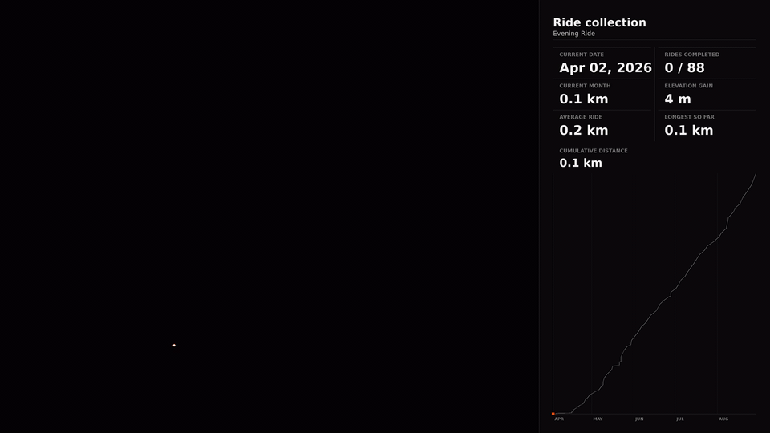
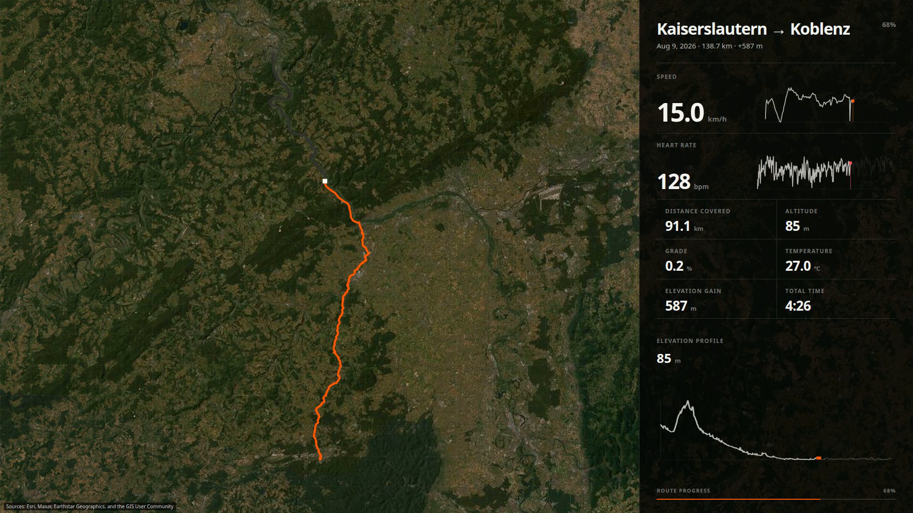
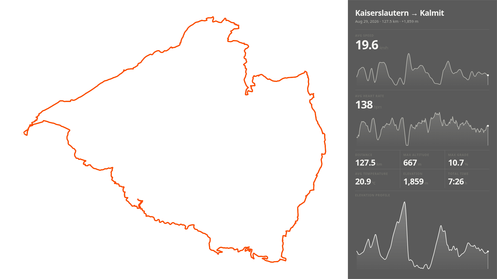
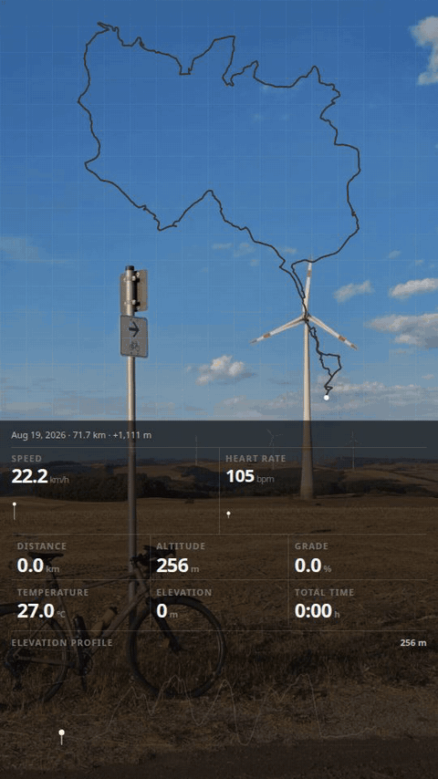

# Ride Visuals

Ride Visuals turns cycling activity archives into maps, reports, and animated
telemetry. It is a small tool born from a personal archive and shared for anyone
who wants to see their rides differently.

## A collection over time

<p align="center">
  
</p>

Routes accumulate chronologically while repeated streets become brighter and
the season totals evolve alongside the map.

```bash
make preview-collection STYLE=density VIDEO_BASEMAP=plain \
  SCOPE="--start-date 2026-02-06"
```

## One ride in detail

<p align="center">
  
</p>

The activity view follows route progress alongside speed, heart rate,
elevation, grade, temperature, and distance. The georeferenced map continues
behind the translucent telemetry column.

```bash
make preview-activity ACTIVITY_ID=<activity-id> TELEMETRY_BASEMAP=satellite
```

## A reusable overlay

<p align="center">
  
</p>

The same route and summary can be exported as a transparent PNG, alpha WebM,
or ProRes 4444 MOV for another layout or editing workflow.

```bash
ride-visuals video overlay <activity-id> --overlay-format png --aspect 16:9 \
  --config config/config.toml
```

### Telemetry over media

<p align="center">
  
</p>

The overlay can also move. The route draws itself while speed, heart rate, and
the other numbers update on screen. Render it over a photo or fully
transparent, in vertical or landscape.

```bash
ride-visuals video telemetry <activity-id> --background-image photo.jpg \
  --background-blur 0 --background-dim 0.18 --aspect 9:16 \
  --title "" --config config/config.toml
```

Every video and overlay type also accepts `--aspect instagram`: the render is
authored in 16:9 and delivered as a 1080×1920 Story, with text and data kept
inside Instagram's safe areas.

## Shape the collection

Collection videos support chronological, simultaneous, elapsed-time, and comet
motion. Routes can be colored by heart rate, temperature, altitude, speed,
grade, month, or a fixed palette, over plain, dark, satellite, topographic, or
OpenStreetMap backgrounds. A quiet light-grey basemap is also available for the
Frost theme.

```bash
ride-visuals video collection --motion elapsed --style altitude --basemap topo \
  --config config/config.toml
```

## Start

You need Python 3.11+, FFmpeg, Node.js, and npm.

```bash
python -m venv .venv
source .venv/bin/activate
pip install -e '.[dev]'
npm --prefix renderer ci --no-bin-links
cp config/config.example.toml config/config.toml
```

If your archive comes from Strava, request it with
[Exporting Your Data and Bulk Export](https://support.strava.com/en-us/articles/15401919-exporting-your-data-and-bulk-export).
Place `activities.csv` and its `activities/` directory under `bulk_download/`,
then generate the complete archive output set:

```bash
make --jobs=6 final
```

Rides recorded outside Strava, or downloaded individually as `.fit` files, can
be added to the collection with `ingest-fit`. The file is copied into the
export, registered in `activities.csv`, and ingested.

```bash
ride-visuals ingest-fit ~/Downloads/Kalmit_Weinstraße.fit --config config/config.toml
```

This ingests the archive into a persistent catalog and streams, then creates three reports, three maps, and collection, progress, and timeline videos in both 16:9 and 9:16.
Individual activity media needs an ID and
is generated separately:

```bash
make final-activity ACTIVITY_ID=<activity-id>
```

## Choose a period

Set dates, years, or months in `config/config.toml`, or pass them directly:

```bash
make preview-collection SCOPE="--year 2025 --month 4"
make final SCOPE="--start-date 2024-02-01 --end-date 2024-12-31"
```

Filters are inclusive and combine with each other. With no filter, every
catalogued activity is used. Ingestion builds the catalog incrementally; use
`ride-visuals ingest --clean --all` for a full archive rebuild. Run `ride-visuals --help` for individual maps,
reports, videos, and activity overlays.

## Development

```bash
make check
```

## License

Copyright (C) 2026 Henrique Lindemann

Ride Visuals is licensed under `AGPL-3.0-only`. The renderer has a narrow
compatibility exception for Remotion; see [LICENSE_EXCEPTION](LICENSE_EXCEPTION).
Remotion remains under its own license. Other credits and terms are listed in
[THIRD_PARTY.md](THIRD_PARTY.md).

---

> *“For all its material advantages, the sedentary life has left us edgy, unfulfilled. Even after 400 generations in villages and cities, we haven’t forgotten. The open road still softly calls, like a nearly forgotten song of childhood. We invest far-off places with a certain romance. This appeal, I suspect, has been meticulously crafted by natural selection as an essential element in our survival.”*
>
> — Carl Sagan
