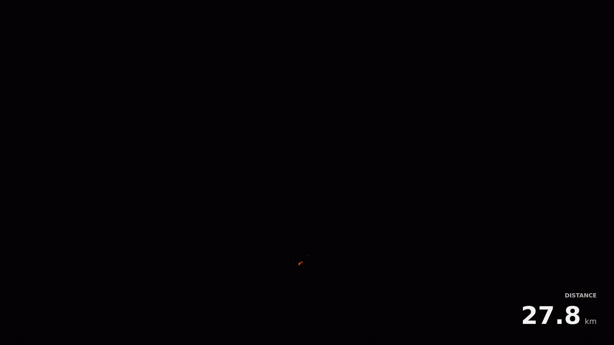
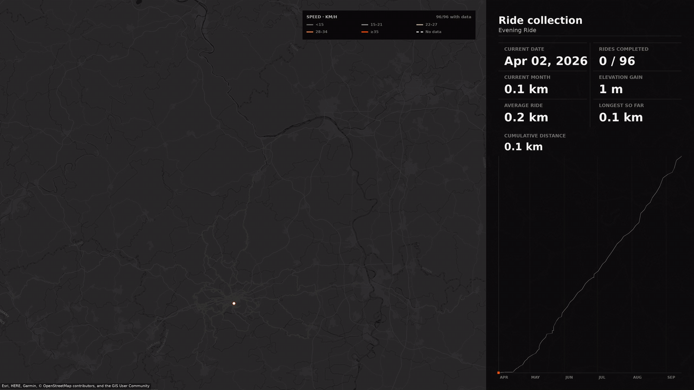
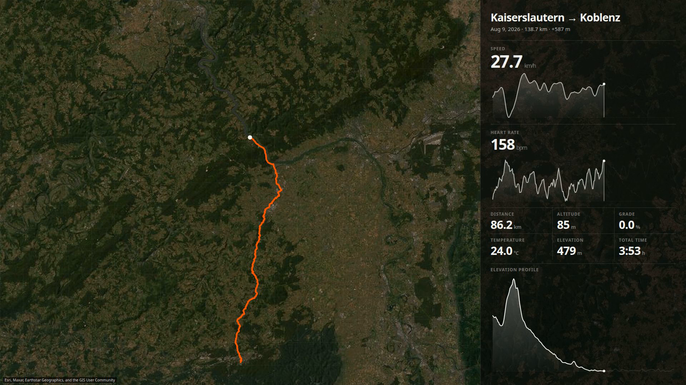
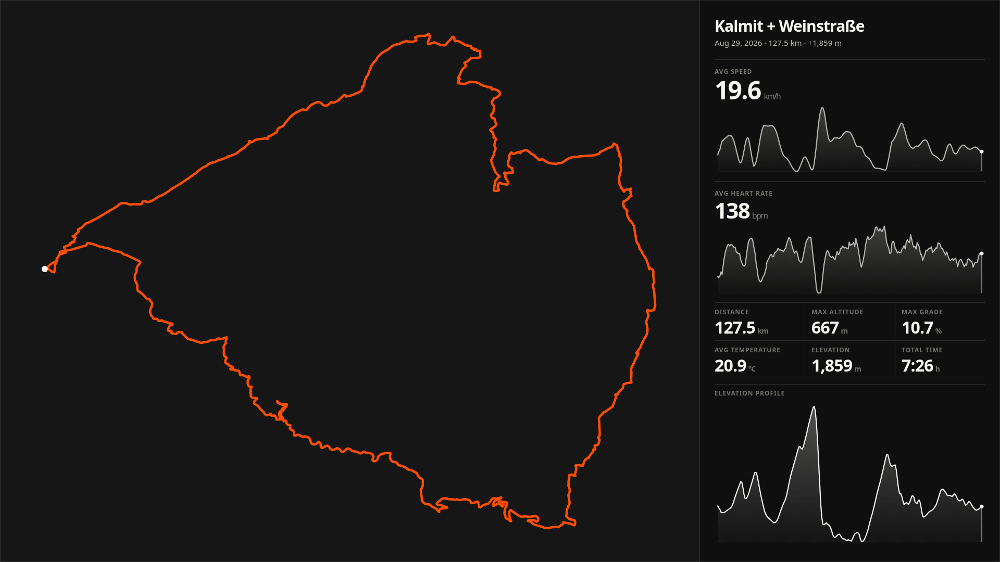
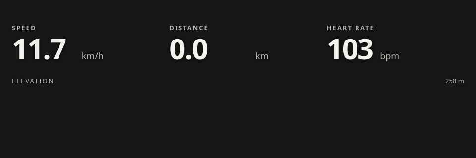
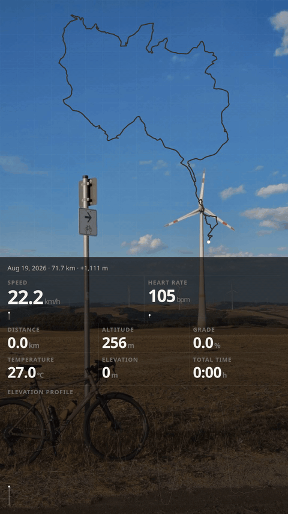

# Ride Visuals

<p align="center">
  
</p>

Ride Visuals turns cycling activity archives into maps, reports, and animated
telemetry. It is a small tool born from a personal archive and shared for anyone
who wants to see their rides differently.

- [What it makes](#what-it-makes)
- [A collection over time](#a-collection-over-time)
- [One ride in detail](#one-ride-in-detail)
- [Start](#start)
- [Choose what to render](#choose-what-to-render)
- [Development](#development)
- [License](#license)

## What it makes

- **Maps**: overview, density, and heart-rate effort maps at 300 DPI, over
  plain, dark, satellite, topographic, or OpenStreetMap basemaps
  (`map overview`, `map heatmap`, `map effort`).
- **Reports**: progress metrics as JSON, an analytics dashboard, and a season
  telemetry timeline (`report progress`, `report dashboard`, `report timeline`).
- **Videos**: a collection accumulating over time, plus progress and season
  timeline movies in 16:9 and 9:16 (`video collection`, `video progress`,
  `video timeline`).
- **Activity renders**: one ride with telemetry, minimal, or clean, and
  transparent overlays for editing (`video telemetry`, `video minimal`,
  `video clean`, `video overlay`, `video route-overlay`, `video stats-overlay`).

Everything lands under `outputs/`: maps in `outputs/maps`, reports in
`outputs/reports`, and videos in `outputs/videos`.

## A collection over time

<p align="center">
  
</p>

```bash
make preview-collection MOTION=chronological STYLE=speed \
  VIDEO_BASEMAP=dark SCOPE="--start-date 2026-02-08"
```

## One ride in detail

<p align="center">
  
</p>

The activity view follows route progress alongside speed, heart rate,
elevation, grade, temperature, and distance.

```bash
make preview-activity ACTIVITY_ID=<activity-id> TELEMETRY_BASEMAP=satellite
```

### A reusable overlay

<p align="center">
  
</p>

The same route and summary can be exported as a transparent PNG, alpha WebM,
or ProRes 4444 MOV for another layout or editing workflow.

```bash
ride-visuals video overlay <activity-id> --overlay-format png --aspect 16:9 \
  --config config/config.toml
```

### Separate overlays

An orange route drawn on transparency, plus minimal speed, distance, heart rate
and elevation. Export both with the same preview setting and align their first
frames in your editor to keep them synchronized.

```bash
ride-visuals video route-overlay <activity-id> --overlay-format mov
ride-visuals video stats-overlay <activity-id> --aspect 16:9 --overlay-format mov
ride-visuals video stats-overlay <activity-id> --aspect 9:16 --overlay-format mov
```

<p align="center">
  
</p>

### Telemetry over media

<p align="center">
  
</p>

The overlay can also move. Render it over a photo or fully transparent, in
vertical or landscape.

```bash
ride-visuals video telemetry <activity-id> --background-image photo.jpg \
  --background-blur 0 --background-dim 0.18 --aspect 9:16 \
  --title "" --config config/config.toml
```

A video can also be used as the background, with its audio preserved. It must
cover the full render (15 s for final activity videos).

```bash
ride-visuals video telemetry <activity-id> --background-video clip.mp4 \
  --background-dim 0.2 --aspect instagram --config config/config.toml
```

Pass `--no-background-video-audio` when only the clip's visuals should be used.

## Start

You need Python 3.11+, FFmpeg, Node.js, and npm.

```bash
python -m venv .venv
source .venv/bin/activate
pip install -e '.[dev]'
npm --prefix renderer ci --no-bin-links
cp config/config.example.toml config/config.toml
```

If your archive comes from Strava, request it with
[Exporting Your Data and Bulk Export](https://support.strava.com/en-us/articles/15401919-exporting-your-data-and-bulk-export).
Place `activities.csv` and its `activities/` directory under `bulk_download/`.

Rides recorded outside Strava, or downloaded individually as `.fit` files, can
be added to the collection with `ingest-fit`. The file is copied into the
export, registered in `activities.csv`, and ingested.

```bash
ride-visuals ingest-fit ~/Downloads/Kalmit_Weinstraße.fit --config config/config.toml
```

With the archive in place, generate the complete output set:

```bash
make --jobs=6 final
```

This ingests the archive into a persistent catalog and streams, then creates
three reports, three maps, and the collection, progress, and timeline videos in
both 16:9 and 9:16. Individual activity media needs an ID and is generated
separately:

```bash
make final-activity ACTIVITY_ID=<activity-id>
```

## Choose what to render

Set defaults in `config/config.toml` or pass flags on the command line;
`--preview` renders a short version before committing to a full one.

### A period

Set dates, years, or months in the config, or pass them directly:

```bash
make preview-collection SCOPE="--year 2025 --month 4"
make final SCOPE="--start-date 2024-02-01 --end-date 2024-12-31"
```

Filters are inclusive and combine with each other. With no filter, every
catalogued activity is used. Use `ride-visuals ingest --clean --all` to rebuild
the catalog from scratch.

### Shape the collection

Collection videos support chronological, simultaneous, and comet motion.
Simultaneous aligns starts and preserves each ride’s real elapsed time, so
shorter rides finish first; `elapsed` is an alias. Routes can be colored by
heart rate, temperature, altitude, speed, grade, month, or a fixed palette,
over plain, dark, satellite, topographic, or OpenStreetMap backgrounds.

```bash
ride-visuals video collection --motion elapsed --style altitude --basemap topo \
  --config config/config.toml
```

Add `--minimal` for a map-first video with only accumulated distance, or
`--clean` to hide the panel. `--cursors`, `--legend`, and `--background-tracks`
show more detail.

### Canvas, language, and theme

Videos render in 16:9, 9:16, 4K (3840×2160), or Instagram Story (authored in
16:9, delivered as a 1080×1920 Story with text kept in the safe areas).
Generated media is English by default; use `--locale pt-BR` for Portuguese.
Themes are `midnight` (the default) and `frost`. Set both with `--theme` and
`--locale`, or in `config/config.toml`.

Run `ride-visuals --help` for individual maps, reports, videos, and activity
overlays.

## Development

```bash
make check
```

`make check` runs linting, tests, and the renderer typecheck. `make help` lists
the common workflows. The README assets are regenerated by
`showcase/generate.sh`; see [showcase/README.md](showcase/README.md).

## License

Copyright (C) 2026 Henrique Lindemann

Ride Visuals is licensed under `AGPL-3.0-only`. The renderer has a narrow
compatibility exception for Remotion; see [LICENSE_EXCEPTION](LICENSE_EXCEPTION).
Remotion remains under its own license. Other credits and terms are listed in
[THIRD_PARTY.md](THIRD_PARTY.md).

---

> *“For all its material advantages, the sedentary life has left us edgy, unfulfilled. Even after 400 generations in villages and cities, we haven’t forgotten. The open road still softly calls, like a nearly forgotten song of childhood. We invest far-off places with a certain romance. This appeal, I suspect, has been meticulously crafted by natural selection as an essential element in our survival.”*
>
> — Carl Sagan
